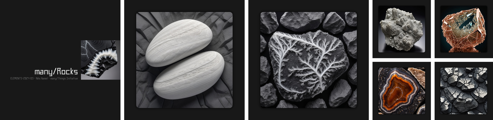
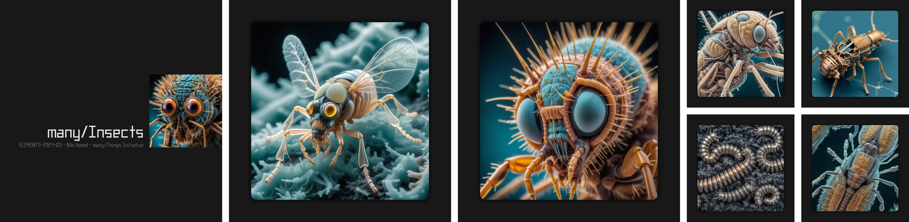

## Overview

This repository holds the elements for _The many/Things Initiative_, including published elements.

## The many/Things Initiative

This initiative serves two main purposes with an open approach.

### Reclaim the high ground

Artificial intelligence-based generative systems devour all our creations and productions to acquire the power they are now known for. This initiative seeks to reverse the situation by utilizing this power to explore realms that should be beyond our reach, with the aim of propelling our own creativity beyond our current limits. That is the bet of this initiative.

### Beyond the Limits

Generative models are constrained by the boundaries of the examples submitted to them during their training. However, they possess a certain ability to transcend these limits. Thus, this initiative also aims to study these boundaries in order to sharpen our perceptions by identifying the true extent of this transcendence.

## Publications

### many/Rocks Elements

      
    <b>many/Rocks E-2024-03, Nils Hamel, 2024-03-13 - <a href="https://drive.proton.me/urls/X72B350K4G#72bVr1E8MkH1">Download the PDF - Hosted on Proton Drive</a></b>

### many/Insects Elements

      
    <b>many/Insects E-2024-03, Nils Hamel, 2024-03-22 - <a href="https://drive.proton.me/urls/1KGZZ5CMC8#RvtKoEsUpQVk">Download the PDF - Hosted on Proton Drive</a></b>

### many/Raised Elements

      
    <b>many/Raised E-2024-03, Nils Hamel, 2024-03-22 - <a href="https://drive.proton.me/urls/NN4T0R1FNG#QHrSFinGwEuL">Download the PDF - Hosted on Proton Drive</a></b>

## Contribute

In the event that this initiative garners interest, the scripts used to compose the e-books will be published on this repository, in addition to the publications themselves, enabling those who wish to contribute to this project with their own publications.

## Licensing

Given the complexity surrounding the issue of rights attribution in the field of generative artificial intelligence, all published documents and images are subject to the [CC BY-NC 4.0](https://www.creativecommons.org/licenses/by-nc/4.0/deed.en) license, which remains permissive while prohibiting the use of documents and content for commercial purposes.

## Attribution

**many/Things Initiative**  
Copyright (c) 2023-2024 Nils Hamel

This work, _The many/Things Initiative_ and its subsequent content, is licensed under the Creative Commons Attribution-NonCommercial 4.0 International (CC BY-NC 4.0) license.
